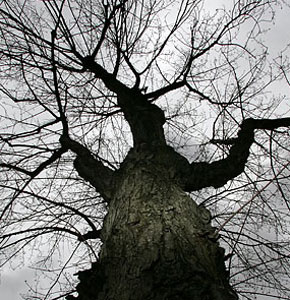

##DESCRIPTION

simpleSlider is an image slider jQuery plugin.  Other similar plugins lay out the elements for you; with this plugin you must take care of all CSS yourself, the plugin just makes it work.  I wrote it this way to give the most control over the design.

**NOTE**  To really work properly, all of the ```<li>``` tags, or the content in them, should have a "width" attribute.


##DEPENDENCIES (all included)

jQuery 1.4.3
jQuery UI 1.8.5
jQuery Address 1.1 (optional, if you want each image to have a unique url)


**MARKUP**
```
<div id="wrapper">
	<div id="sliderPrevBtn"></div>
	<div id="slider">
		<div id="sliderInner">
			<ul>
				<li></li>
				<li></li>
				<li></li>
				<li></li>
				<li></li>
			</ul>
		</div>
	</div>
	<div id="sliderNextBtn"></div>
	<div id="numberButtons"></div>
</div>	     
``` 

**USAGE**
``` javascript
$('#slider').simpleSlider({fade: true,
	useAddress: true,
	numberButtons: true
});
```


**OPTIONS**
``` javascript
prevId: 'sliderPrevBtn' //the id of the div containing the previous button (back arrow)
nextId: 'sliderNextBtn' //the id of the div containing the next button (forward arrow)	
speed: 1000 //the speed (in milliseconds) of the transition
width: 550 //the width of the image viewport
height: 300 //the height of the image viewport
fade: false //if the images should fade in/out on transition 
useAddress: false //uses hash marks to give each image a unique url
numberButtons: false //creates a number button to click on for each image
numberButtonId: 'numberButtons' //the id of the div to create the numbers in
numberSeperator: '/' //the character to put in between the number buttons.  (e.g: 1 / 2 / 3)
```